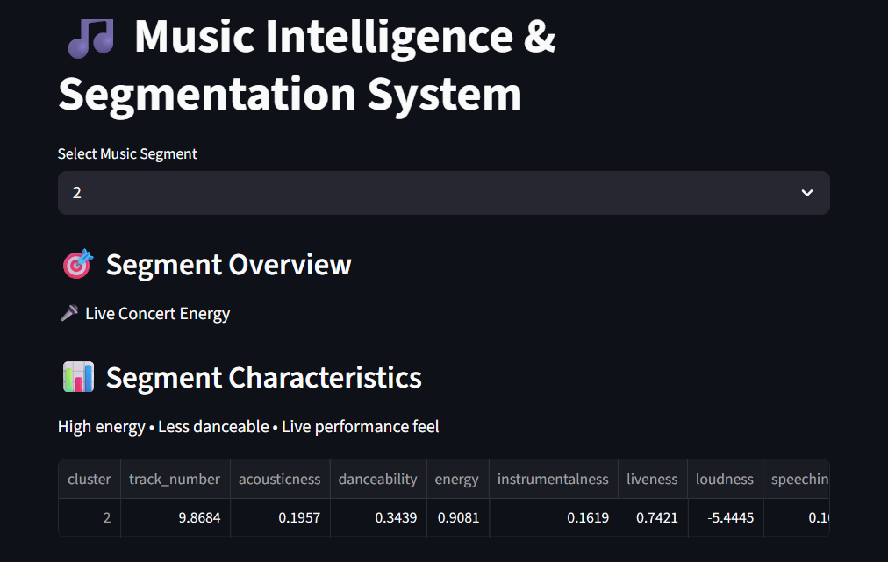

# 🎵 AI Song Clustering & Recommendation System

A Machine Learning-powered system to segment songs into meaningful clusters and provide intelligent music recommendations.

---

## 🚀 Overview

This project uses **unsupervised learning (KMeans clustering)** to group songs based on audio features such as:

- Energy
- Danceability
- Acousticness
- Loudness
- Instrumentalness
- Liveness

Each cluster represents a **music segment (cohort)**, enabling:

✔ Music segmentation  
✔ Insight generation  
✔ Recommendation system  

---

## 🎯 Key Features

- 🎧 Music segmentation using KMeans
- 📊 Cluster profiling with human-readable labels
- 🔍 Feature engineering & preprocessing pipeline
- 🎵 Song recommendation system
- 🌐 Interactive Streamlit web app

---

## 🧠 Model Details

| Model | Type |
|------|------|
| KMeans | Unsupervised Clustering |

- Number of clusters: 3
- Features scaled using StandardScaler
- Cluster labeling based on feature analysis

---

## 📂 Project Structure
ai-song-clustering-system/
│
├── data/
│ ├── raw/
│ └── processed/
│
├── models/
│
├── notebooks/
│
├── src/
│ ├── preprocessing.py
│ ├── clustering.py
│ ├── profiling.py
│ ├── recommend.py
│ ├── train.py
│
├── app.py
├── requirements.txt
├── README.md
├── .gitignore

---

## ⚙️ Installation

git clone https://github.com/Viswamusunuri9/ai-song-clustering-system
cd ai-song-clustering-system
pip install -r requirements.txt

▶️ Run the Project
1. Train Model

python -m src.train

2. Run App

streamlit run app.py

📊 Sample Output
🔥 Energetic Rock
🎧 Balanced Listening
🎤 Live Concert Energy

Each segment includes:

Characteristics
Feature summary
Recommended songs

🧩 Future Improvements
Personalized recommendations (cosine similarity)
Dynamic cluster tuning
Genre enrichment
Deployment (Streamlit Cloud)

Demo

👨‍💻 Author

Viswa Musunuri
Mechanical Engineer | AI/ML Enthusiast | Builder